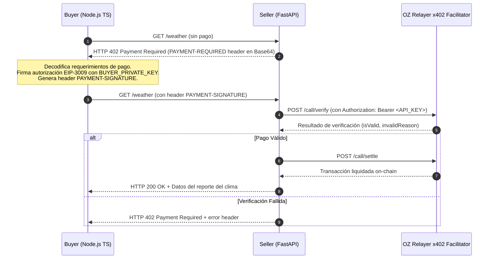

# x402 Test: Buyer (Node.js/TypeScript) <-> Seller (Python FastAPI)

Programa de prueba para validar el flujo completo de pagos x402 (V2) entre un cliente en TypeScript Node.js (**Buyer**) y un servidor backend en FastAPI (**Seller**), utilizando como facilitador un **OpenZeppelin Relayer con plugin x402**.

---

## 🏗️ Arquitectura y Flujo



---

## 📁 Estructura del Proyecto

```
x402-test/
├── .env                  # Variables de entorno reales
├── .env.example          # Plantilla de variables de entorno
├── README.md             # Esta documentación
├── buyer/                # Cliente x402 en Node.js TypeScript
│   ├── package.json
│   ├── tsconfig.json
│   └── src/
│       ├── index.ts      # Cliente de pago automático (wrapFetchWithPayment)
│       └── test-402.ts   # Script de prueba rápida para verificar respuesta 402
└── seller/               # Backend protegido por x402 en Python FastAPI
    ├── requirements.txt
    └── main.py           # Servidor FastAPI con PaymentMiddlewareASGI
```

---

## ⚙️ Configuración (.env)

Copia `.env.example` a `.env` en la raíz de `x402-test/` y rellena los valores:

```env
# URL base que expone los endpoints /call/supported, /call/verify, /call/settle
FACILITATOR_URL=https://dot-revealable-telescopically.ngrok-free.dev/api/v1/plugins/x402/call
FACILITATOR_API_KEY=tu_api_key_del_relayer

# Wallet del vendedor que recibe los pagos
SELLER_WALLET_ADDRESS=0xf92A1E3Fa1a163FEeB8c3753165410374fB08339
SELLER_PORT=4021

# Private key de la wallet del comprador (debe tener fondos USDC en Fuji)
BUYER_PRIVATE_KEY=0x...
SELLER_URL=http://localhost:4021
```

---

## 🚀 Instalación y Ejecución (Entorno Virtual `venv`)

### 1. Iniciar el Servidor Seller (Python FastAPI)

#### 🪟 En Windows (PowerShell / CMD):

```powershell
# 1. Navegar a la carpeta seller
cd seller

# 2. Crear el entorno virtual
python -m venv venv

# 3. Activar el entorno virtual
# En PowerShell:
.\venv\Scripts\Activate.ps1
# O en CMD:
# .\venv\Scripts\activate.bat

# 4. Instalar dependencias
pip install -r requirements.txt

# 5. Iniciar el servidor
python main.py
```

#### 🐧 En Linux / macOS (Bash / Zsh):

```bash
# 1. Navegar a la carpeta seller
cd seller

# 2. Crear el entorno virtual
python3 -m venv venv

# 3. Activar el entorno virtual
source venv/bin/activate

# 4. Instalar dependencias
pip install -r requirements.txt

# 5. Iniciar el servidor
python main.py
```

El servidor iniciará en `http://localhost:4021`:
- `GET /health` (público, status del servicio y facilitador)
- `GET /weather` (protegido con pago x402 de 1000 atomic units / 0.001 USDC)

---

### 2. Probar Respuesta 402 (Sin Pago)

En otra terminal:

```bash
cd buyer
npm install
npm run test:402
```

Verifica que el servidor responde `HTTP 402` y devuelve el header `payment-required` con las instrucciones EIP-712/EIP-3009 decodificadas para Avalanche Fuji.

---

### 3. Ejecutar Flujo de Pago Completo (Buyer)

```bash
cd buyer
npm start
```

El cliente:
1. Realiza un health check a `/health`
2. Solicita `/weather`
3. Captura el 402, firma el payload EIP-3009 con viem y reintenta con `PAYMENT-SIGNATURE`
4. El seller reenvía la verificación al facilitador OpenZeppelin Relayer

---

## 🔍 Hallazgos y Correcciones Clave

1. **Ruta del Facilitador OpenZeppelin Relayer**:
   - Los endpoints del plugin del relayer son `/api/v1/plugins/x402/call/supported`, `/call/verify` y `/call/settle`.
   - Por tanto, `FACILITATOR_URL` debe incluir `/call` para que el SDK de x402 concatene correctamente los métodos.

2. **Autenticación al Relayer**:
   - OpenZeppelin Relayer requiere el header `Authorization: Bearer <FACILITATOR_API_KEY>`.
   - Se implementó `BearerAuthProvider` en el seller adaptando `AuthHeaders` para `HTTPFacilitatorClient`.

3. **Estructura de Precios en FastAPI (`x402.http`)**:
   - `PaymentOption.price` espera formato con keys `amount`, `asset`, y `extra`.

4. **Identificador de Red y Spend Controls en el Buyer**:
   - El relayer anuncia la red como `"avalanche:fuji"`. En el buyer se extendió `ExactEvmScheme` (`FujiExactEvmScheme`) para mapear internamente a `eip155:43113` durante la firma EIP-712 sin perder compatibilidad con el identificador del facilitador.
   - Se configuró `client.spendControls = false` para permitir tokens de testnet no predeterminados.

5. **Soporte EVM en `OpenZeppelin/relayer-plugin-x402-facilitator`**:
   - El plugin oficial de OpenZeppelin actualmente en producción (`relayer-plugin-x402-facilitator` v0.5.0) anuncia redes EVM en `/supported`, pero internamente en `src/handler.ts` la lógica de `handleVerify` y `handleSettle` solo tiene implementado `case "stellar":`. Las solicitudes para redes EVM devuelven actualmente `{"invalidReason":"unsupported_network","isValid":false}` en el facilitador hasta que OpenZeppelin complete la integración de relayers EVM en el plugin.
